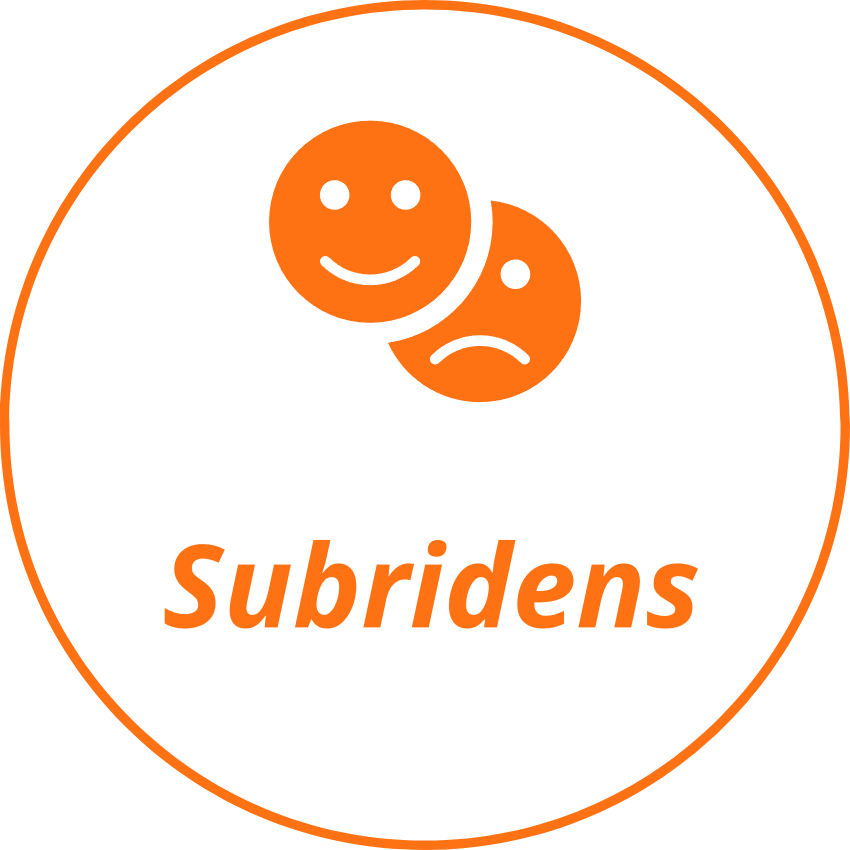

# Subridens AI 

 

### Smile recognition AI

(AI project for the Computer Science Matriculation Exam)

 

See the [subridens.ipynb](subridens.ipynb) file for more details on the project.

## Example

